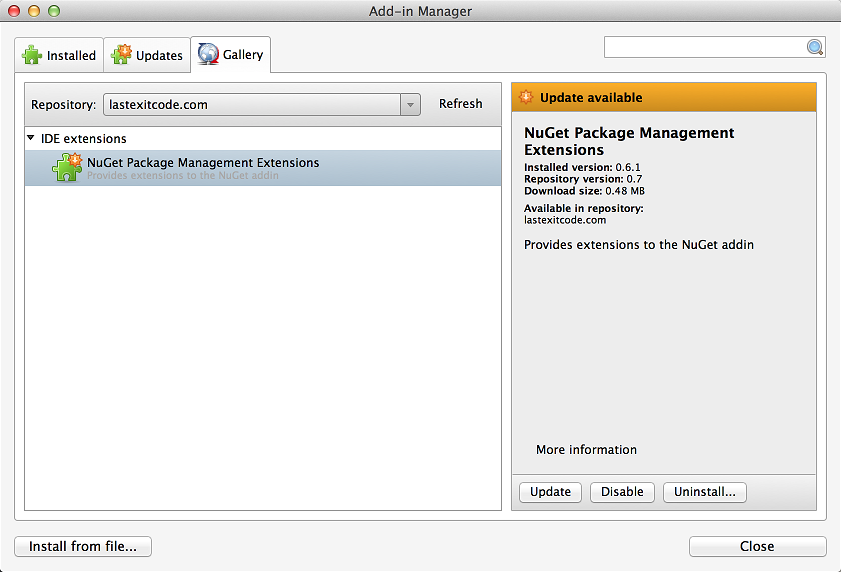

# Hosts addins for MonoDevelop and Xamarin Studio

MonoDevelop and Xamarin Studio 5.0 addin repository url:

  http://lastexitcode.com/monodevelop-addins/5.0/main.mrep  
  
MonoDevelop and Xamarin Studio 6.0 addin repository url:

  http://lastexitcode.com/monodevelop-addins/6.0/main.mrep

MonoDevelop 7.0 and Visual Studio for Mac addin repository url:

  http://lastexitcode.com/monodevelop-addins/7.0/main.mrep

# Adding repository to MonoDevelop or Xamarin Studio

 * Open the **Add-in Manager** dialog.
 * Select the **Gallery** tab.
 * Open the Repository drop down list and select Manage Repositories.
 * Click the Add button.
 * Enter the url for MonoDevelop 5.0: http://lastexitcode.com/monodevelop-addins/5.0/main.mrep
 * Or enter the url for MonoDevelop 6.0: http://lastexitcode.com/monodevelop-addins/6.0/main.mrep
 * Click OK.
 * Expand **IDE extensions**.
 * Select **NuGet Package Management Extensions**.
 * Click the **Refresh** button if the addin is not visible.
 * Click **Install...** or **Update** to install the addin.

